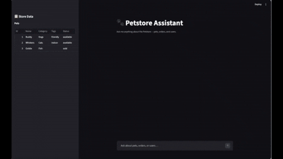

# MCP Project Example



An end-to-end example showing how to expose a REST API as an **MCP (Model Context Protocol) server**, query it with an **LLM-powered client** (Azure OpenAI), interact with it through a **Streamlit chatbot**, and measure tool-calling quality with an **evaluation framework** — all built around the classic [Petstore](https://petstore.swagger.io/) API.

---

## Quick Start

1. Open the project in the dev container — all dependencies are installed automatically.
2. Log in to the Azure subscription that contains your Azure OpenAI instance:

```bash
az login -t <your-tenant-id>
```

3. Create a `.env` file in the project root with your Azure OpenAI endpoint:

```dotenv
AZURE_OPENAI_ENDPOINT=https://<your-resource>.openai.azure.com/
AZURE_OPENAI_MODEL=gpt-4o          # optional, defaults to gpt-4o
```

4. Run the webapp or evaluation using the terminal (or the VS Code launch configs below):

```bash
# Webapp
streamlit run webapp/app.py

# Evaluation
cd evaluation && python run_eval.py
```

Both commands start the Petstore REST API server automatically — no separate API server process needed.

### Launch Configs

The project includes VS Code launch configurations (`.vscode/launch.json`) for each component. Open the **Run and Debug** panel (`Ctrl+Shift+D`) and select one:

| Configuration | What it does |
|---|---|
| **Webapp** | Starts the Streamlit chatbot at `http://localhost:8501` |
| **Evaluation** | Runs the full evaluation suite with `batch-size=4` |
| **MCP Server** | Starts the MCP server standalone |
| **MCP Client** | Runs the MCP client script directly |
| **API Server** | Starts the Petstore REST API server only |
| **API Client Tests** | Runs the generated API client test suite with `pytest` |

---

## Table of Contents

1. [Overview](#overview)
2. [Architecture](#architecture)
3. [Prerequisites](#prerequisites)
4. [Configuration](#configuration)
5. [Component Guides](#component-guides)
   - [API Server](#1-api-server)
   - [MCP Server](#2-mcp-server)
   - [MCP Client](#3-mcp-client)
   - [Webapp](#4-webapp)
   - [Evaluation](#5-evaluation)
   - [Shared Library](#6-shared-library)

---

## Overview

This project demonstrates the full lifecycle of building an AI agent that interacts with a real REST API through the Model Context Protocol:

1. A **Petstore REST API** (Flask/Connexion) serves as the backend data source.
2. An **MCP server** wraps the API's OpenAPI spec, exposing each HTTP endpoint as an MCP tool with LLM-friendly descriptions.
3. An **MCP client** connects to the server, feeds user questions to Azure OpenAI, and routes the model's tool-call responses back through the MCP server to the API.
4. A **Streamlit webapp** provides a chat UI backed by the MCP client, with a live sidebar showing the current store inventory.
5. An **evaluation framework** runs a predefined question set, checks whether the model called the correct tools with the correct arguments, and renders a visual accuracy report.

---

## Architecture

```
┌─────────────────────────────────────────────────────────────────┐
│                          User / Webapp                          │
│                   (Streamlit chat interface)                     │
└────────────────────────────┬────────────────────────────────────┘
                             │ natural-language question
                             ▼
┌─────────────────────────────────────────────────────────────────┐
│                         MCP Client                              │
│          (Azure OpenAI  ◄──►  MCP ClientSession via stdio)      │
└────────────────────────────┬────────────────────────────────────┘
                             │ tool calls (MCP protocol, stdio)
                             ▼
┌─────────────────────────────────────────────────────────────────┐
│                         MCP Server                              │
│         (FastMCP — OpenAPI spec → MCP tools + resources)        │
└────────────────────────────┬────────────────────────────────────┘
                             │ HTTP requests
                             ▼
┌─────────────────────────────────────────────────────────────────┐
│                    Petstore REST API Server                      │
│              (Flask/Connexion — http://localhost:8080/v2)        │
└─────────────────────────────────────────────────────────────────┘
```

---

## Prerequisites

| Requirement | Notes |
|---|---|
| Azure OpenAI resource | Any region with `gpt-4o` (or another chat model) |

---

## Installation

All dependencies are installed automatically when the dev container is created via `postCreate.sh` — no manual setup is required.

---

## Configuration

Create a `.env` file in the project root:

```dotenv
AZURE_OPENAI_ENDPOINT=https://<your-resource>.openai.azure.com/
AZURE_OPENAI_MODEL=gpt-4o          # optional, defaults to gpt-4o
```

The client uses `DefaultAzureCredential` for authentication — make sure you are logged in via `az login` or have a managed identity / service principal configured in your environment.

---

## Component Guides

### 1. API Server

**Location:** `api/server/`

A Flask/Connexion REST server generated from the [Petstore OpenAPI spec](https://petstore.swagger.io/) — a widely-used example API describing a fictional pet store with pets, orders, and users. The server stores all data in-memory and is seeded with sample records on startup.

Once running, the full interactive API documentation is available at the Swagger UI:

```
http://localhost:8080/v2/ui/
```

**Install and run:**

```bash
pip install -r api/server/requirements.txt
bash api/start_server.sh
# Server available at http://localhost:8080/v2/ui/
```

**Regenerate from spec** (requires `openapi-generator-cli` on `PATH`):

```bash
bash api/generate.sh
```

---

### 2. MCP Server

**Location:** `mcp/server/`

Reads the runtime OpenAPI spec (`api/server/openapi_server/openapi/openapi.yaml`) and uses **[FastMCP's OpenAPI integration](https://fastmcp.wiki/en/integrations/openapi)** to convert every HTTP endpoint into an MCP tool.

`FastMCP.from_openapi()` parses the spec and, by default, maps every route to an MCP **Tool** — regardless of HTTP method. Each tool is named after the operation's `operationId` and its description is derived from the OpenAPI summary/description fields. An `httpx.AsyncClient` is provided to handle the actual HTTP traffic to the running API server.

Fine-grained per-tool customisation is applied via the `mcp_component_fn` callback: after each component is created, `_customize_components` in `server.py` looks up the tool name in `tool_descriptions.py` and, if a custom description exists, replaces the generated one. This lets you tailor tool descriptions for the LLM without touching the OpenAPI spec.

**Install:**

```bash
pip install -r mcp/server/requirements.txt
```

**Run:**

```bash
python mcp/server/server.py
```

**Customising tool descriptions:**

Edit `mcp/server/tool_descriptions.py`. The `CUSTOM_TOOL_DESCRIPTIONS` dict maps MCP tool names (e.g. `"find_pets_by_status"`) to plain-English strings that replace the tool's generated description. Comment entries out to observe how accuracy changes during evaluation.

---

### 3. MCP Client

**Location:** `mcp/client/mcp_client.py`

An async `MCPClient` class that:
1. Spawns the MCP server as a subprocess over **stdio**.
2. Connects an `AzureOpenAI` chat client authenticated via `DefaultAzureCredential`.
3. Exposes a `process_question(question)` coroutine that drives a multi-turn tool-calling loop until the model returns a final natural-language answer.

**Install:**

```bash
pip install -r mcp/client/requirements.txt
```

---

### 4. Webapp

**Location:** `webapp/app.py`

A **Streamlit** chatbot that wraps the `MCPClient`. Features:
- Full multi-turn conversation with the pet store assistant.
- **Sidebar** with a live data panel auto-refreshing every 5 seconds showing the current inventory.
- Optional auto-start of the API server via `--start-api-server`.

**Install:**

```bash
pip install -r webapp/requirements.txt
```

**Run:**

```bash
streamlit run webapp/app.py
```

The app will open at `http://localhost:8501`.

---

### 5. Evaluation

**Location:** `evaluation/`

Measures how accurately the LLM (via the MCP client) selects and invokes the right tools for a set of predefined questions.

**Files:**

| File | Description |
|---|---|
| `expected.json` | Ground truth: list of `{ question_id, question, tool_calls }` objects |
| `actual.json` | Written by `run_eval.py`: the model's actual tool calls for each question |
| `output.json` | Comparison report (pass/fail per question, accuracy scores) |
| `output.png` | Bar chart of per-question tool and argument accuracy |

**Install:**

```bash
pip install -r evaluation/requirements.txt
```

**Run:**

```bash
cd evaluation
python run_eval.py
```

The evaluation script starts the API server automatically.

**Metrics reported:**

- **Tool accuracy** — fraction of questions where the model called the correct tool(s).
- **Argument accuracy** — fraction of questions where both the tool name and arguments matched expected.

**Simulating failures:**

To see what evaluation failures look like, comment out one or more entries in `mcp/server/tool_descriptions.py`. For example, removing the `find_pets_by_status` description typically causes 1–2 questions to fail, because the model loses the guidance needed to pick the right tool or pass the correct arguments. Re-run the evaluation to compare the report.

**Adding questions:**

Append entries to `evaluation/expected.json` in the format:

```json
{
  "question_id": 99,
  "question": "How many pets are pending?",
  "tool_calls": [
    { "tool_name": "find_pets_by_status", "tool_arguments": { "status": ["pending"] } }
  ]
}
```

---

### 6. Shared Library

**Location:** `shared/`

Utility code used across multiple components.

| Module | Description |
|---|---|
| `shared.model.mcp_client` | `ToolCall` and `QuestionResult` dataclasses (JSON-serialisable via `dataclasses-json`) |
| `shared.api.api_server_manager` | `ApiServerManager` — starts/stops the API server subprocess and waits for it to be healthy before returning |


